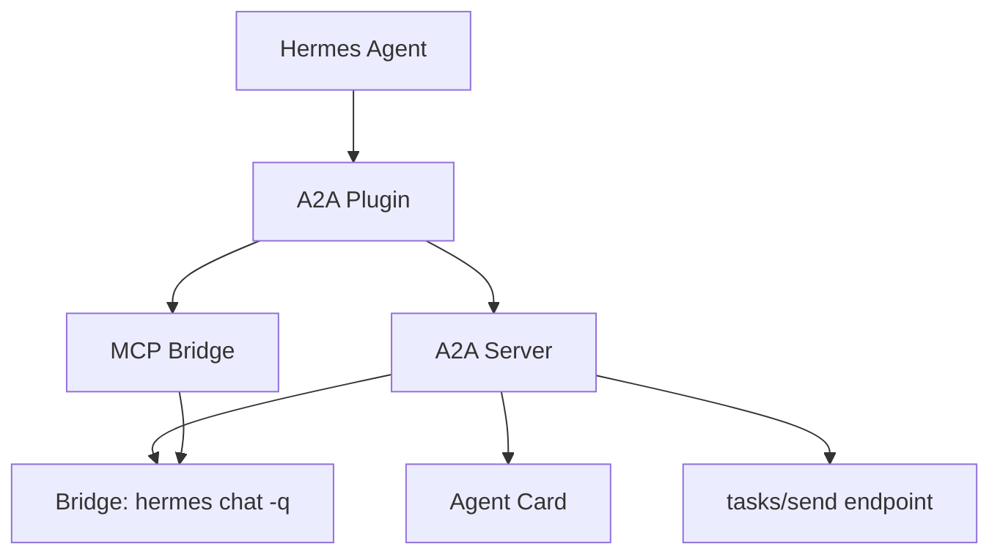

# Development Guide

## Local Setup

```bash
# Prerequisites: Python 3.10+, Hermes Agent, git

# Clone
git clone https://github.com/maisonnat/hermes-a2a-plugin.git
cd hermes-a2a-plugin

# Virtual environment
python3 -m venv .venv
source .venv/bin/activate

# Install in dev mode
make install-dev

# Run tests
make test

# Build docs
make docs

# Serve docs locally
make serve-docs
# → Open http://localhost:8000
```

## Project Architecture



See [Architecture](../architecture.md) for full details.

## Testing

```bash
# All tests
make test                    # pytest -v

# Specific files
python -m pytest tests/test_plugin.py -v
python -m pytest tests/test_bridge.py -v

# With coverage
pip install pytest-cov
python -m pytest --cov=hermes_a2a_plugin tests/
```

## Docs

```bash
# Build (strict mode — 0 warnings required)
mkdocs build --strict

# Live preview
mkdocs serve

# Deploy to GitHub Pages
mkdocs gh-deploy --force
```

## Releasing

1. Update version in:
   - `hermes_a2a_plugin/__init__.py`
   - `hermes_a2a_plugin/server.py`
   - `pyproject.toml`
2. Update `CHANGELOG.md`
3. Tag: `git tag v0.2.0 && git push --tags`
4. GitHub Actions builds + deploys docs automatically

## Extending the Plugin

### Adding a new tool
1. Add schema in `schemas.py`
2. Add handler in `__init__.py`
3. Add `ctx.register_tool()` in `register()`
4. Add test in `tests/`

### Adding a new hook
1. Add handler function in `__init__.py`
2. Add `ctx.register_hook()` in `register()`

### Adding a new MCP tool (for OpenCode)
1. Add tool definition in `bridge_mcp.py` (`AVAILABLE_TOOLS`)
2. Add handler in `bridge_mcp.py` (map in `handle_tools_call`)
3. Add test in `tests/test_bridge.py`
